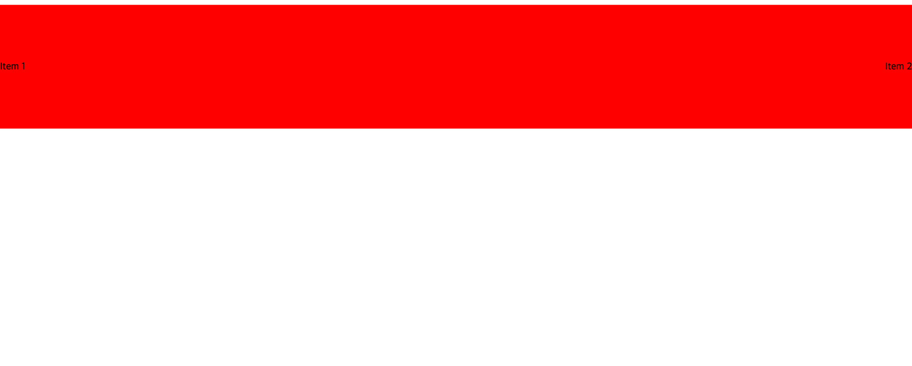
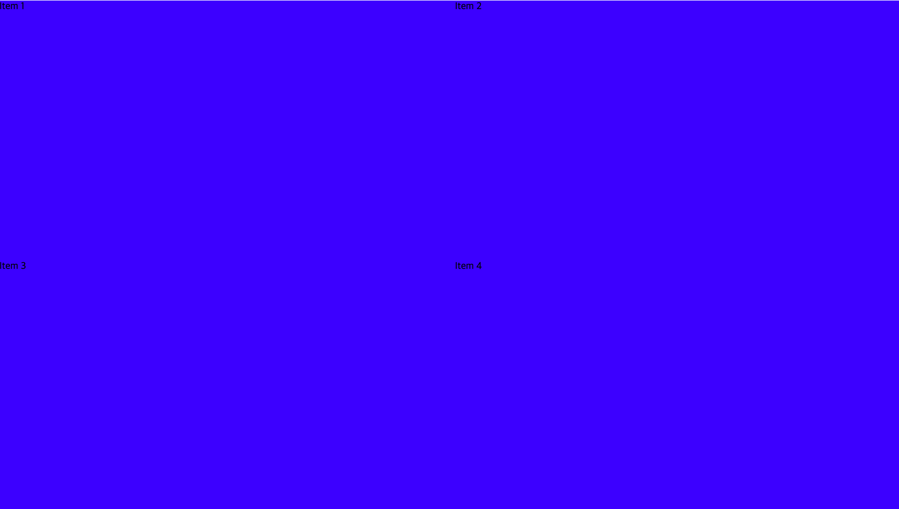

# 컴포넌트 사용법

# **Container Component**

Container **컴포넌트는 CSS의 기본적인 레이아웃 속성을 설정할 수 있도록 만들어진 범용 컴포넌트입니다.**

# **Props**

**display: CSS display 속성을 설정합니다. 가능한 값은 "block", "inline-block", "flex", "inline-flex"입니다.**

**padding: CSS padding 속성을 설정합니다. 문자열로 입력받습니다.**

**width,** height**: 컴포넌트의 너비와 높이를 설정합니다. 숫자나 문자열로 입력받습니다.**

**maxWidth, maxHeight: 컴포넌트의 최대 너비와 높이를 설정합니다. 숫자나 문자열로 입력받습니다.**

**minWidth, minHeight: 컴포넌트의 최소 너비와 높이를 설정합니다. 숫자나 문자열로 입력받습니다.**

**backgroundColor: 배경색을 설정합니다. 문자열로 색상 코드를 입력받습니다.**

**oveflow: CSS overflow 속성을 설정합니다. 가능한 값은 "hidden", "scroll", "auto", "visible"입니다.**

# **Usage**

```jsx
function App() {
  return (
    <Container
      display="flex"
      padding="20px"
      minWidth={200}
      maxWidth={200}
      backgroundColor="#f0f0f0"
    >
      Content here
    </Container>
  );
}
export default App;
```


# **Flex Component**

**Flex 컴포넌트는 CSS flexbox 레이아웃을 쉽게 설정할 수 있도록 만들어진 범용 컴포넌트입니다.**

**Container 컴포넌트를 확장하여 만들어졌으며, 추가로 flex 관련 속성들을 설정할 수 있습니다.**

# **Props**

**`direction`: CSS flex-direction 속성을 설정합니다. 가능한 값은 "row", "row-reverse", "column", "column-reverse"입니다.**

**`justify`: CSS justify-content 속성을 설정합니다. 가능한 값은 "flex-start", "flex-end", "center", "space-between", "space-around", "space-evenly"입니다.**

**`align`: CSS align-items 속성을 설정합니다. 가능한 값은 "stretch", "flex-start", "flex-end", "center", 'baseline' 입니다.**

**`gap`: CSS gap 속성을 설정합니다. 숫자를 입력받습니다.**

**그 외에도 ContainerProps에서 상속받은 모든 props를 사용할 수 있습니다.**

# **Usage**

```jsx
function App() {
  return (
    <Flex
      direction="row"
      justify="center"
      align="center"
      gap={10}
      width={200}
      height={200}
    >
      <div>Item 1</div>
      <div>Item 2</div>
    </Flex>
  );
}
export default App;
```



# **Grid Component**

**`Grid` 컴포넌트는 CSS grid 레이아웃을 쉽게 설정할 수 있도록 만들어진 범용 컴포넌트입니다.**

**`Container` 컴포넌트를 확장하여 만들어졌으며, 추가로 grid 관련 속성들을 설정할 수 있습니다.**

# **Props**

**`rows`: 그리드의 행 수를 설정합니다. 숫자를 입력받습니다.**

**`columns`: 그리드의 열 수를 설정합니다. 숫자를 입력받습니다.**

**`gap`: 그리드 셀 사이의 간격을 설정합니다. 숫자를 입력받습니다.**

**그 외에도 ContainerProps에서 상속받은 모든 props를 사용할 수 있습니다.**

# **Usage**

```jsx
function App() {
return (
<Grid 
      rows={2}
      columns={2}
      gap={10}
      width={200}
      height={200}
    >
<div>Item 1</div>
<div>Item 2</div>
<div>Item 3</div>
<div>Item 4</div>
</Grid>
);
}
export default App;

```


# Masonry 컴포넌트

`Masonry`는 Pinterest 스타일의 레이아웃을 생성하는 데 사용되는 범용 컴포넌트입니다. 이 컴포넌트는 여러 열로 구성된 그리드를 만들며, 각 항목은 가장 짧은 열에 추가됩니다.

## Props

- **`columns`:** 그리드의 열 수를 설정합니다. 숫자를 입력받습니다.
- **`gap`:** 그리드 셀 사이의 간격을 설정합니다. 숫자를 입력받습니다.
- **`children`:** Masonry 레이아웃 내부에 배치할 요소들입니다. ReactNode 타입을 받습니다.

## 사용법

```jsx
import { Masonry } from './components/Masonry';

function App() {
  return (
    <Masonry columns={3} gap={10}>
      <div style={{ height: '200px', background: '#8e44ad' }} />
      <div style={{ height: '300px', background: '#3498db' }} />
      <div style={{ height: '250px', background: '#c0392b' }} />
      <div style={{ height: '350px', background: '#f1c40f' }} />
      {/* 필요한 만큼 항목 추가 */}
    </Masonry>
  );
}

export default App;
